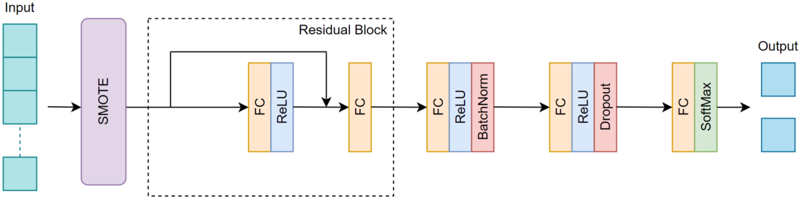

# SmokingStatusPrediction4COPD

**Supplementary Data for:**  
**Development of a deep learning model to predict smoking status in patients with chronic obstructive pulmonary disease: A secondary analysis of cross-sectional national survey **

> **Note:** This repository has been created to support replication of methods described in a research article: https://doi.org/10.1177/205520762513336

---

## 📁 Repository Overview

This repository contains supplementary materials for our study focused on predicting smoking status among patients with Chronic Obstructive Pulmonary Disease (COPD) using deep learning techniques applied to national survey data.

---

## 🧠 Proposed Model Architecture

We developed a Residual Neural Network (ResNN) architecture—a feedforward neural network with residual connections—to predict smoking status. The model includes an input layer with 21 features, three hidden layers with 512 ReLU-activated nodes each, and an output layer with Softmax activation. A residual connection from the input to the first hidden layer improves information flow and mitigates vanishing gradients. The model was trained using the AdamW optimizer (learning rate = 0.0001) and focal loss to address class imbalance.



 *Overview of the proposed classification model for predicting smoking status. Abbreviations: BatchNorm, batch normalization; FC, fully connected layer; ReLU, rectified linear unit; SMOTE, synthetic minority over-sampling technique.*

---
 
 

## 📊 Experiment Results

The proposed model achieved superior performance (AUROC 0.73, sensitivity 70.1%, specificity 75.2%, F1-score 0.67) in predicting smoking status in COPD patients, with SHAP analysis highlighting sex, age, and perceived health status as key predictors. [More ...](https://doi.org/10.1177/205520762513336)

## 📌 Citation

Please cite our forthcoming article when using this repository. 

```
Pant S, Yang HJ, Cho S, Ryu E, Choi JY. Development of a deep learning model to predict smoking status in patients with chronic obstructive pulmonary disease: A secondary analysis of cross-sectional national survey. DIGITAL HEALTH. 2025;11. doi:10.1177/20552076251333660
```

---

 
